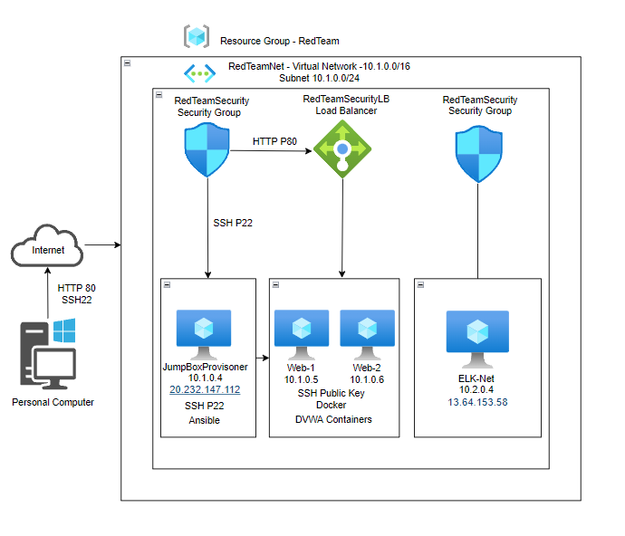
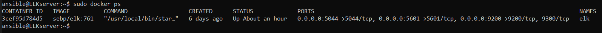

# ELK-Stack-Project
ELK Stack project submission for  UCDavis-CyberSecurity Bootcamp 

## Automated ELK Stack Deployment

The files in this repository were used to configure the network depicted below.

These files have been tested and used to generate a live ELK deployment on Azure. They can be used to either recreate the entire deployment pictured above. Alternatively, select portions of the _____ file may be used to install only certain pieces of it, such as Filebeat.

  - [install-elk.yml](Scripts/install-elk.yml)
  - [filebeat-configuration.yml](Scripts/filebeat-configuration.yml)
  - [filebeat-playbook.yml](Scripts/filebeat-playbook.yml)
  - [metricbeat-configuration.yml](Scripts/metricbeat-configuration.yml)
  - [metricbeat-playbook.yml](Scripts/metricbeat-playbook.yml)

This document contains the following details:
- Description of the Topology
- Access Policies
- ELK Configuration
  - Beats in Use
  - Machines Being Monitored
- How to Use the Ansible Build

### Description of the Topology

The main purpose of this network is to expose a load-balanced and monitored instance of DVWA, the D*mn Vulnerable Web Application.

Load balancing ensures that the application will be highly redundant, in addition to restricting access to the network.

What aspect of security do load balancers protect? 
Load balancers add resiliency by rerouting live traffic from one server to another if a server comes under attack or if the server becomes unavailable 

What is the advantage of a jump box?
A Jump Box Provisioner is important because it prevents VMs within Azure from being exposed with their Public IP. A JumpBox also allows 

Integrating an ELK server allows users to easily monitor the vulnerable VMs for changes to the logs and system metrics.
- Filebeat monitors the location of log files as specified by the System administrator. Filebeat can take the logs and place them in a centralized location specified by the System administrator.
- Metricbeat takes the metrics and statistics that it collects and sends them to the specified output by the System administrator. 

The configuration details of each machine may be found below.

| Name     | Function     | IP Address | Operating System |
|----------|--------------|------------|------------------|
| Host     | Workstation  | x.x.x.x    | Windows 10       |
| Jump Box | Gateway 	    | 10.1.0.4   | Linux            |
| Web-1    | DVWA Server  | 10.1.0.5   | Linux            |
| Web-2    | DVWA Server  | 10.1.0.6   | Linux            |
| ELK-Net  | ELK Stack    | 10.2.0.4   | Linux            |

### Access Policies

The machines on the internal network are not exposed to the public Internet. 

Only the Jump-Box machine can accept connections from the Internet. Access to this machine is only allowed from my personal workstation IP address.

Machines within the network can only be accessed by Jump-Box.
- ELK-Net also accepts public connections but only from my personal IP address.

A summary of the access policies in place can be found in the table below.

| Name     | Publicly Accessible | Allowed IP Addresses |
|----------|---------------------|----------------------|
| Jump Box | Yes                 | 10.1.0.4             |
| Web-1    | No                  | 10.1.0.5             |
| Web-2    | No                  | 10.1.0.6             |
| Elk-Net  | Yes                 | 10.2.0.4             |

### Elk Configuration

Ansible was used to automate configuration of the ELK machine. No configuration was performed manually, which is advantageous because the automation allows for the quick configuration of the containers. This allows elasticity as well as scalability. 

The playbook implements the following tasks:
- Configure elk with Docker
- Increase virtual memory
- Use more memory
- Install Docker.io
- Install Python3-pip
- Install Python Docker Module
- Download and launch a Docker Web Container

The following screenshot displays the result of running `docker ps` after successfully configuring the ELK instance.

### Target Machines & Beats
This ELK server is configured to monitor the following machines:
- 10.1.0.4
- 10.1.0.5
- 10.1.0.6

We have installed the following Beats on these machines:
- Filebeat
- Metricbeat

These Beats allow us to collect the following information from each machine:
- Filebeat allows you to monitor and collect log files or location, you can find graphs showing the traffic of your server, the amount of unique connections, and the errors received by these connections. Also showing the source IP, geolocation, and url it was accessed from.
- Metricbeat collects and analyzes the metrics of the applications running on your machine. Metricbeat will show Inbound and Outbound traffic, Memory usage, Disk usage, CPU usage, and other metrics.

### Using the Playbook
In order to use the playbook, you will need to have an Ansible control node already configured. Assuming you have such a control node provisioned:
- Verify the Public IP address to see if it has changed.
- If changed then update the Security Rules that uses the My Public IPv4 

SSH into the control node and follow the steps below:
- Copy the .yml file to the ansible directory.
- Update the config file to include remote users and ports.
- Run the playbook, and navigate to Kibana (Your IP Address:5601) to check that the installation worked as expected.

As a **Bonus**, provide the specific commands the user will need to run to download the playbook, update the files, etc.
~~~sh
ssh-keygen                          #create a ssh key for setup VM's
sudo cat .ssh/id_rsa.pub	          #to view the ssh public key
ssh azadmin@Jump-Box-Provisioner    #IP address	to log into the Jump-Box-Provisioner
sudo docker container list -a	      #list all docker containers
sudo docker container start cranky_volhard	#start docker container cranky_volhard
sudo docker container attach cranky_volhard	#effectively sshing into the cranky_volhard container
cd /etc/ansible	                    #Change directory to the Ansible directory
ls -laA	                            #List all file in directory (including hidden)
nano /etc/ansible/hosts	            #to edit the hosts file
nano /etc/ansible/ansible.cfg	      #to edit the ansible.cfg file
nano /etc/ansible/pentest.yml	      #to edit the My-Playbook
ansible-playbook [location][filename]	#to run the playbook
ssh ansible@Web-1 IP address	      #to log into the Web-1 VM
ssh ansible@Web-2 IP address	      #to log into the Web-2 VM
ssh ansible@ELKserver               #IP address	to log into the ELKserver VM
exit                              	#to exit out of docker containers/Jump-Box-Provisioners
nano /etc/ansible/ansible.cfg	      #to edit the ansible.cfg file
nano /etc/ansible/hosts	            #to edit the hosts file
nano /etc/ansible/pentest.yml	      #to edit the My-Playbook
ansible-playbook [location][filename]	#to run the playbook
sudo apt-get update	                #this will update all packages
sudo apt install docker.io	        #install docker application
sudo service docker start	          #start the docker application
sudo systemctl status docker	      #status of the docker application
sudo systemctl start docker	        #start the docker service
sudo docker pull cyberxsecurity/ansible	#pull the docker container file
ansible -m ping all	                #check the connection of ansible containers
curl -L -O [location of the file on the web]	#to download a file from the web
dpkg -i [filename]	                #to install the file i.e. (filebeat & metricbeat)
http://http://13.64.153.58cd:5601//app/kibana	 #Open web browser and navigate to Kibana Logs
nano filebeat-config.yml	          #create and edit filebeat config file
nano filebeat-playbook.yml	        #write YAML file to install filebeat on webservers
nano metricbeat-config.yml	        #create metricbeat config file and edit it
nano metricbeat-playbook.yml	      #write YAML file to install metricbeat on webservers
~~~
